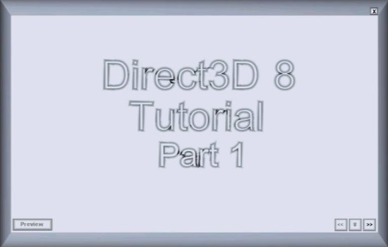



## Direct3D 8 Tutorials For Beginners Part 1 \(Must See\!\!\)

### Description

Part 1 covers and explains Direct3D objects and how to use them. If you tried my DDraw Tutorial you'll love this one. Please leave some feedback good or bad, and if you like it or dislike votes are welcome. Thanks in advance -James-
 
### More Info
 

             |
---                |---
**Submitted On**   |2002-03-26 19:47:30
**By**             |[James Dougherty](https://github.com/Planet-Source-Code/PSCIndex/blob/master/ByAuthor/james-dougherty.md)
**Level**          |Beginner
**User Rating**    |4.4 (40 globes from 9 users)
**Compatibility**  |VB 6\.0
**Category**       |[DirectX](https://github.com/Planet-Source-Code/PSCIndex/blob/master/ByCategory/directx__1-44.md)
**World**          |[Visual Basic](https://github.com/Planet-Source-Code/PSCIndex/blob/master/ByWorld/visual-basic.md)
**Archive File**   |[Direct3D\_8657053262002\.zip](https://github.com/Planet-Source-Code/james-dougherty-direct3d-8-tutorials-for-beginners-part-1-must-see__1-33103/archive/master.zip)

